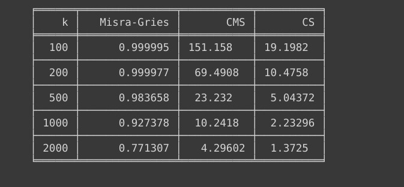
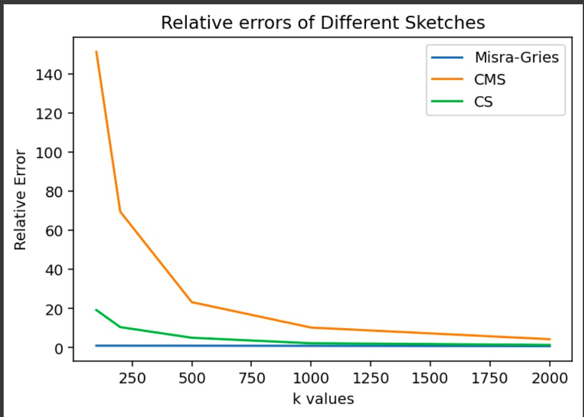
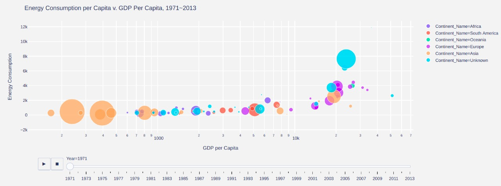
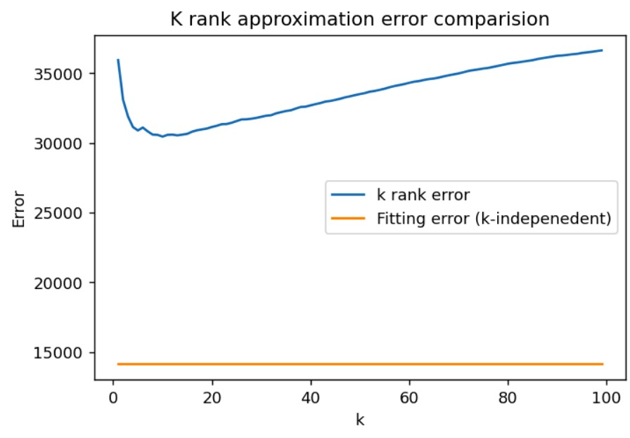

# Data Science ⭐

A repository containing datascience implementational resources

## Directory Architecture: 📁
DataScience
├─ CMS-CS-MG.ipynb
├─ Optimal_Greedy_K_center.ipynb
├─ README.md
├─ data_visualization.ipynb
└─ low_rank_approximation(SVD).ipynb
#

## Count-Min-Sketch, Count-Sketch, Misra-Gries Implementations and Performance comparision 🔥

## Data Visualization 🔥

Here is the link to video: https://youtu.be/H4l6AK_pquM

## Optimal K-center and Greedy K-center (two approximate) Comaprision 🔥

## Low-Rank-Approximation-Matrix 🔥

